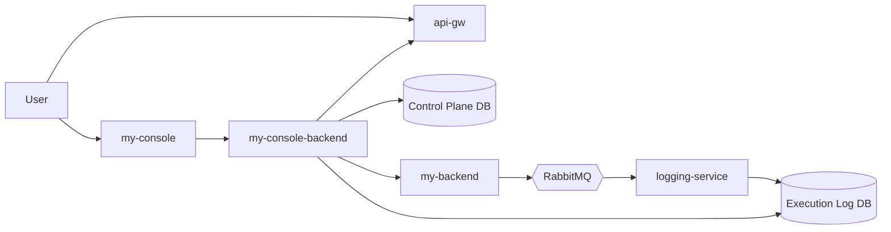

# System Overview And Operations

**Status**: [Baseline]

## 1. 목적
- NexioOne 전체 모듈 구성을 한 눈에 이해할 수 있도록 정리한다.
- 주요 처리 흐름, 트랜잭션 처리 수준, 운영 절차를 통합 관점에서 설명한다.
- 세부 문서가 여러 폴더로 나뉘어 있는 상태에서 온보딩 기준 문서로 사용한다.

## 2. 전체 시스템 구성

### 2.1 모듈 분류
| 그룹 | 모듈 | 역할 |
|---|---|---|
| Control Plane | `my-console` | 사용자 UI, 설계/운영 화면 |
| Control Plane | `my-console-backend` | 인증, CRUD, 배포, 실행 오케스트레이션 |
| Data Plane | `my-backend` | flow 실행, dry-run, execute-stub, runtime 상태 제공 |
| Data Plane | `api-gw` | 외부 요청 진입점, 인증/인가, 정책 적용 |
| Support Service | `logging-service` | runtime 이벤트 수집, 실행 로그 영속화 |
| Support Service | `plugins` | 런타임 컴포넌트 계열의 논리 이름. 실제로는 `my-backend-component-api`와 `my-backend-component` 분리 구조를 포함 |
| Infrastructure | `k8s` | 배포/운영 환경 구성 |

### 2.2 공유 인프라
| 인프라 | 용도 | 현재 프로그램 포함 여부 |
|---|---|---|
| RDB | 프로젝트, Flow, DataDefinition, Connection, Deployment, 실행 로그 저장 | 포함 |
| RabbitMQ | runtime execution event 전달 | 포함 |
| Redis | config sync, cache, 분산 스케줄 제어 | 차기 범위 중심 |
| Object Storage | 대용량 payload/archive | 차기 범위 |

### 2.3 상위 구조

핵심 원칙:
- Control Plane은 설계, 저장, 배포, 권한을 담당한다.
- Data Plane은 실행을 담당한다.
- 실행 결과 영속화는 `logging-service`가 담당한다.
- `my-console-backend`는 execution read facade 역할만 수행한다.
- 실행 제어용 단건 상태의 정본은 `my-backend`다.
- 사용자용 실행 이력/검색의 정본은 `logging-service` read model이다.

## 3. 모듈별 책임 경계

### 3.1 my-console
- 프로젝트/Flow/DataDefinition/Connection/Deployment 관리 화면 제공
- dry-run / execute-stub 호출 UI 제공
- runtime 상태와 실행 이력 조회 UI 제공

### 3.2 my-console-backend
- JWT 기반 인증/권한 검증
- 프로젝트/Flow/DataDefinition/Connection CRUD
- Deployment 생성/상태 변경/롤백
- runtime 실행 요청 생성
- `my-backend` 상태 API 중계
- logging read model 조회 후 UI용 응답 가공

### 3.3 my-backend
- `flowDefinition`, `connectionProfiles`, `inputContext`, `options`를 받아 실행
- `DRY_RUN`, `EXECUTE_STUB` 제공
- execution 상태 조회 제공
- execution 이벤트를 outbox + MQ로 발행

### 3.4 logging-service
- runtime 이벤트 수신
- event schema validation
- execution / step read model 저장
- 차후 execution 조회 API 제공 가능

### 3.5 api-gw
- 외부 요청 ingress
- 중앙 인증/인가 확장 포인트
- 차후 route/policy xDS 동기화

### 3.6 plugins
- `plugins`는 단일 실행 바이너리라기보다 런타임 컴포넌트 계열의 논리 그룹으로 본다.
- 상세 설계 기준 구성은 다음과 같다.
  - `my-backend`: 실행 엔진 호스트. lifecycle, context, transaction coordination, logging 발행 담당
  - `my-backend-component-api`: 모든 컴포넌트가 공유하는 API/인터페이스 계층
  - `my-backend-component`: `MAPPING`, `REST_CLIENT`, `SQL_EXECUTOR` 등 node별 canonical logic 구현 계층
- 현재 프로그램에서는 이 계층이 주로 stub/골격 중심으로 정의된다.

### 3.7 k8s
- 서비스 배포 단위 정의
- HPA, anti-affinity, config distribution, secret 관리 등 운영 환경 구성

## 4. 주요 처리 흐름

### 4.1 설계 및 배포 흐름
1. 사용자가 `my-console`에서 Flow/DataDefinition/Connection을 편집한다.
2. `my-console-backend`가 이를 검증하고 DB에 저장한다.
3. 사용자가 Deployment를 생성한다.
4. `my-console-backend`가 deployment snapshot을 확정한다.
5. 차후 범위에서는 snapshot 변경이 runtime/api-gw에 동기화된다.

### 4.2 Dry-Run 흐름
1. 사용자가 `my-console`에서 dry-run을 요청한다.
2. `my-console-backend`가 Flow, Connection, 입력값을 조합해 runtime 요청 payload를 만든다.
3. `my-backend`가 구조/입력 검증을 수행한다.
4. 결과를 동기 응답으로 반환한다.
5. 필요 시 execution 이벤트를 발행하고 `logging-service`가 저장한다.

### 4.3 Execute-Stub 흐름
1. 사용자가 sync 또는 async execute-stub을 요청한다.
2. `my-console-backend`가 runtime 실행 요청을 생성한다.
3. `my-backend`가 지원 노드 기준으로 stub 실행을 수행한다.
4. sync면 즉시 결과를 반환한다.
5. async면 `ACCEPTED`와 `executionId`를 반환한다.
6. 실행 제어 상태는 `my-backend` 상태 API를 기준으로 조회된다.
7. 장기 이력/검색은 `logging-service` read model을 통해 조회된다.

### 4.4 실행 로그 흐름
1. `my-backend`가 execution lifecycle event를 outbox에 저장한다.
2. publisher worker가 RabbitMQ로 publish한다.
3. `logging-service`가 event를 consume한다.
4. `execution_event`, `execution_record`, `execution_step`에 upsert한다.
5. `my-console-backend`가 logging DB/전용 schema direct read로 read model을 조회해 UI에 제공한다.

### 4.5 상태 조회 Ownership
- `GET /api/projects/{projectId}/runtime/executions/{executionId}`의 정본은 `my-backend`다.
- 실행 중 상태(`ACCEPTED`, `RUNNING`)는 `logging-service` 적재 지연과 무관하게 `my-backend` 기준을 우선한다.
- 완료 후 장기 이력/검색/목록 조회는 `logging-service` read model을 사용한다.
- 이번 프로그램에서는 제어 상태 조회와 이력 조회를 별도 API 책임으로 분리한다.
- stage 1 read path는 `my-console-backend -> logging DB/전용 schema direct read로 고정한다.
- logging read API는 차기 범위다.

## 5. 트랜잭션 처리 수준

### 5.1 현재 프로그램 기준
- Control Plane CRUD:
  - `my-console-backend` DB 로컬 트랜잭션
- Runtime 실행:
  - `my-backend` 내부 로컬 처리
  - 외부 connector 실호출 없음
- Event 처리:
  - outbox 저장과 publish를 분리한 `eventual consistency`
  - 보장 수준은 `at-least-once`
- Logging 저장:
  - consumer DB commit 후 ack

즉, 현재 프로그램의 기본 모델은:
- Control Plane: 강한 일관성에 가까운 로컬 DB 트랜잭션
- Runtime/Logging: 비동기 이벤트 기반 최종 일관성

### 5.2 차기 범위 트랜잭션
- 실제 connector 실행이 들어오면 `my-backend` 내부 로컬 트랜잭션만으로는 부족할 수 있다.
- `SQL_EXECUTOR`, `FLOW_TASK`, 분산 DB 업데이트가 들어가면 Seata/XA 기반 분산 트랜잭션을 검토한다.
- 해당 내용은 `my-backend-distributed-transaction-design.md`가 다루며, 현재 프로그램 기본 구현 범위는 아니다.

### 5.3 트랜잭션 경계 정리
| 흐름 | 기본 경계 | 현재 수준 |
|---|---|---|
| Project/Flow/DataDefinition/Connection CRUD | `my-console-backend` DB transaction | 포함 |
| Deployment 생성 | `my-console-backend` DB transaction | 포함 |
| Runtime dry-run | `my-backend` request scope | 포함 |
| Runtime execute-stub sync | `my-backend` request scope | 포함 |
| Runtime execute-stub async | request acceptance + background execution 분리 | 포함 |
| Execution event publish | outbox -> MQ 비동기 | 포함 |
| Event consume -> log persist | `logging-service` DB transaction | 포함 |
| Cross-service XA/2PC | Seata/XA | 차기 범위 |

## 6. 운영 절차 기준

### 6.1 배포 절차
1. Control Plane 서비스 배포
2. Data Plane 서비스 배포
3. RabbitMQ/DB/Redis 상태 확인
4. runtime skeleton 및 health check 확인
5. dry-run / execute-stub smoke test 수행

### 6.2 롤백 절차
1. 장애 배포 버전 식별
2. Deployment 상태를 `ROLLED_BACK` 또는 이전 목표 상태로 전환
3. 앱 배포도 이전 이미지/구성으로 되돌림
4. MQ backlog, execution error, DLQ 증가 여부 확인

### 6.3 장애 대응 절차

#### Runtime 실행 실패
1. `my-backend` error code와 execution status 확인
2. 지원 노드 범위 위반 여부 확인
3. `logging-service`에 completed/failed event가 들어왔는지 확인

#### Event 적재 실패
1. runtime outbox pending count 확인
2. RabbitMQ queue depth / DLQ count 확인
3. `logging-service` consumer 에러 및 DB write 실패 확인

#### DB/메시징 인프라 장애
1. DB failover 여부 확인
2. RabbitMQ quorum queue 상태 확인
3. app connection pool 재연결 여부 확인

### 6.4 보안 운영 절차
1. master key rotation 시 dual-key support 활성화
2. Connection secret 갱신 후 config sync/캐시 invalidate 확인
3. 토큰 유출 시 refresh token revoke 및 세션 무효화

### 6.5 DR 절차
1. DB PITR 또는 replica 승격
2. Redis failover 또는 재구성
3. RabbitMQ quorum queue 복제 상태 점검
4. 앱 재기동 후 smoke test 수행

## 7. 운영 시 확인할 핵심 지표
- Control Plane API latency / error rate
- runtime execution success rate
- outbox pending count
- RabbitMQ queue depth / DLQ count
- logging-service DB write success/failure
- deployment sync drift
- worker health

## 8. 현재 프로그램에서 특히 주의할 점
- 문서상 차기 범위와 현재 범위를 혼동하지 않는다.
- `DRY_RUN`과 `EXECUTE_STUB`를 실제 connector 실행으로 오해하지 않는다.
- execution 결과 저장은 동기 응답이 아니라 logging pipeline 기준으로 본다.
- XA/2PC, object storage archive, distributed scheduler는 현재 프로그램의 기본 구현 기준이 아니다.

## 9. 참조
- `docs/spec/modules/README.md`
- `docs/spec/foundation/release-scope.md`
- `docs/spec/api/internal-api-contract-design.md`
- `docs/spec/runtime/runtime-operations-spec.md`
- `docs/spec/runtime/runtime-execution-logging-architecture.md`
- `docs/spec/modules/my-backend-distributed-transaction-design.md`
- `docs/spec/quality/ha-dr-operations.md`
- `docs/spec/security/security-operations-guide.md`
