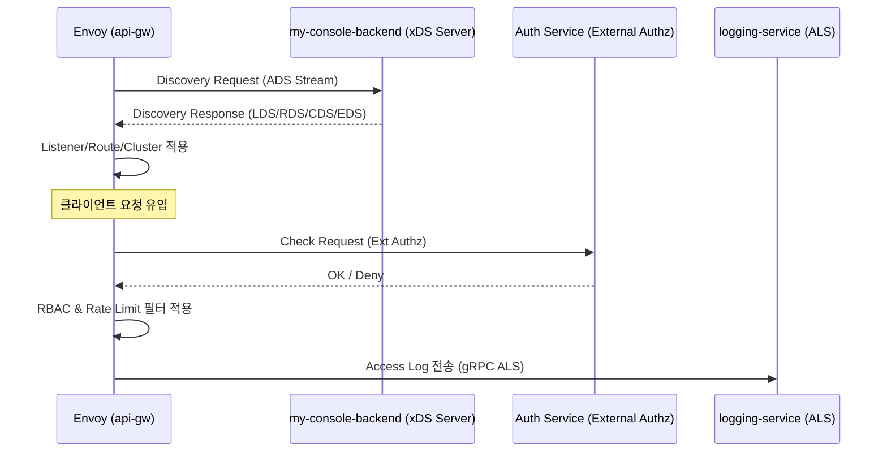

# api-gw Detailed Design (Envoy xDS & Filter)

**Status**: [Draft/Detailed Design]
**Parent Module**: [api-gw](api-gw.md)

## 1. 개요
본 문서는 Envoy Proxy를 NexioOne의 API Gateway로 활용하기 위한 xDS(Discovery Service) 기반의 동적 설정 동기화 메커니즘과 커스텀 필터 체인의 상세 구현 설계를 정의한다.

## 2. 아키텍처 및 데이터 흐름
`my-console-backend`는 xDS 서버 역할을 수행하며, Envoy는 xDS 클라이언트로서 gRPC 스트림을 통해 설정을 실시간으로 수신한다.



## 3. xDS (Control Plane) 인터페이스 설계

### 3.1 서비스 유형 (Aggregated Discovery Service - ADS)
- **LDS (Listener Discovery)**: 다운스트림 연결을 받는 포트 및 필터 체인 설정.
- **RDS (Route Discovery)**: HTTP 경로 매핑, 가상 호스트 및 헤더 조작 규칙.
- **CDS (Cluster Discovery)**: 업스트림 서비스(my-backend 등) 그룹 및 로드밸런싱 정책.
- **EDS (Endpoint Discovery)**: 클러스터 내 개별 인스턴스 IP/Port 정보.

### 3.2 gRPC 서비스 정의 (v3 API 기준)
```protobuf
service AggregatedDiscoveryService {
  rpc StreamAggregatedResources(stream DiscoveryRequest)
    returns (stream DiscoveryResponse);
  rpc DeltaAggregatedResources(stream DeltaDiscoveryRequest)
    returns (stream DeltaDiscoveryResponse);
}
```

## 4. 필터 체인 (Filter Chain) 설계

### 4.1 HTTP Connection Manager 필터 순서
1. **`envoy.filters.http.jwt_authn`**: JWT 유효성 1차 검증 (Signature, Expiry).
2. **`envoy.filters.http.ext_authz`**: `my-console-backend` 또는 별도 인증 서비스와 연동하여 API 권한(RBAC) 검증.
3. **`envoy.filters.http.ratelimit`**: Redis 기반 글로벌 처리량 제한 적용.
4. **`envoy.filters.http.lua`** (또는 Wasm): 요청/응답 페이로드 변환 및 NexioOne 전용 헤더(`X-Nexio-Transaction-Id` 등) 주입.
5. **`envoy.filters.http.router`**: 최종 업스트림 라우팅.

### 4.2 External Authz 페이로드 예시
Envoy가 인증 서버로 보내는 체크 요청에 포함될 메타데이터:
- `path`: `/api/v1/orders`
- `method`: `POST`
- `headers`: `Authorization: Bearer <token>`
- `metadata`: `project_id`, `api_key_id` (LDS/RDS에서 주입됨)

## 5. 동적 설정 구조 (JSON 예시)

### 5.1 LDS (Listener)
```json
{
  "name": "listener_0",
  "address": { "socket_address": { "address": "0.0.0.0", "port_value": 8443 } },
  "filter_chains": [{
    "filters": [{
      "name": "envoy.filters.network.http_connection_manager",
      "typed_config": {
        "@type": "type.googleapis.com/envoy.extensions.filters.network.http_connection_manager.v3.HttpConnectionManager",
        "stat_prefix": "ingress_http",
        "rds": { "config_source": { "ads": {} }, "route_config_name": "local_route" },
        "http_filters": [
          { "name": "envoy.filters.http.ext_authz", "typed_config": { ... } },
          { "name": "envoy.filters.http.router", "typed_config": { ... } }
        ]
      }
    }]
  }]
}
```

### 5.2 RDS (Route)
```json
{
  "name": "local_route",
  "virtual_hosts": [{
    "name": "nexio_service",
    "domains": ["*"],
    "routes": [{
      "match": { "prefix": "/api/project1/" },
      "route": { "cluster": "project1_backend_cluster" }
    }]
  }]
}
```

## 6. 보안 및 운영 전략
- **SDS (Secret Discovery Service)**: `my-console-backend`에서 관리하는 TLS 인증서를 Envoy로 안전하게 전송.
- **ALS (Access Log Service)**: 모든 트래픽 로그를 gRPC 스트림으로 `logging-service`에 전송하여 실시간 관제 및 감사 추적.
- **Health Check**: Envoy가 업스트림(`my-backend`)의 `/health` 엔드포인트를 주기적으로 체크하여 가용성 확보.

## 7. 구현 로드맵
1.  **Phase 1**: 정적 `envoy.yaml` 기반 기본 라우팅 및 Local Authz 구현.
2.  **Phase 2**: `my-console-backend` 내 Java 기반 xDS 서버(gRPC) 스켈레톤 구축.
3.  **Phase 3**: RDS/CDS 동적 동기화 및 Redis 기반 Rate Limit 연동.
4.  **Phase 4**: Wasm/Lua 필터를 통한 고도화된 페이로드 변환 및 모니터링 적용.
