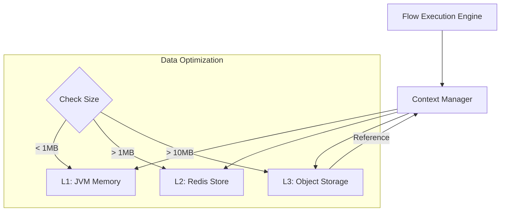

# my-backend Execution Engine Detailed Design (Context, Streaming & Flow Control)

**Status**: [Draft/Design]
**Parent Module**: [my-backend](my-backend.md)
**Related Design**: [runtime-node-support-matrix.md](../runtime/runtime-node-support-matrix.md)

## 1. 개요
본 문서는 `my-backend` 실행 엔진(Execution Engine)의 핵심 메커니즘인 실행 컨텍스트(Execution Context) 관리 및 데이터 최적화 전략, 대용량 처리를 위한 스트리밍 파이프라인, 그리고 노드 간 실행 흐름 제어(Routing) 및 최종 응답 구성(Response Composition)에 대한 상세 설계 방안을 정의한다. 이를 통해 고성능 대용량 데이터 처리의 안정성과 복잡한 비즈니스 로직 제어의 유연성을 동시에 확보하는 것을 목적으로 한다.

## 2. 계층형 컨텍스트 관리 전략 (Tiered Storage)

데이터의 크기와 성격에 따라 저장 위치를 동적으로 결정한다.

| 계층 | 대상 데이터 크기 | 저장소 | 특징 |
| :--- | :--- | :--- | :--- |
| **L1: Hot (Memory)** | < 1MB (Threshold) | JVM Heap (Map) | 즉시 접근, 가장 빠름 |
| **L2: Warm (Redis)** | 1MB ~ 10MB | Redis (Off-Heap) | 멀티 워커 간 공유 가능, 메모리 절약 |
| **L3: Cold (Storage)** | > 10MB | Object Storage (MinIO/S3) | 참조(Reference) 기반 접근, I/O 비용 발생 |

### 2.1 Pass-by-Reference 메커니즘
- 데이터가 Threshold를 초과하면 자동으로 L3에 저장하고 컨텍스트에는 `ExternalReference` 객체를 남긴다.
- **ExternalReference 구조**:
  ```json
  {
    "__nexio_ref": true,
    "provider": "S3_COMPATIBLE",
    "bucket": "runtime-temp-context",
    "objectKey": "ctx/{executionId}/{nodeId}.json",
    "size": 52428800,
    "contentType": "application/json"
  }
  ```
- 다음 노드에서 해당 데이터를 읽을 때, `ContextManager`가 자동으로 Storage에서 스트림으로 읽어와 전달한다.

## 3. Execution Context Manager 설계

### 3.1 컨텍스트 스왑 (Context Externalization)
- 노드 실행 사이(Checkpoint)에 전체 컨텍스트를 Redis에 직렬화하여 저장함으로써 워커 메모리 점유를 최소화한다.
- **비동기 플로우**: 비동기 실행 시에는 무조건 Redis에 컨텍스트를 저장하고 워커 스레드를 반환한다.

### 3.2 데이터 정리 (Pruning & Scoping)
- **Output Selection**: 각 노드는 전체 결과 중 다음 노드에 필요한 필드만 선택(Select)하여 컨텍스트에 반영하는 기능을 제공한다.
- **Lifecycle Management**:
  - `execution.completed` 시점에 임시 저장된 L2/L3 데이터를 삭제하는 백그라운드 태스크 수행.
  - `LOOP` 내의 로컬 변수는 반복이 종료되면 즉시 제거.

### 3.3 아키텍처 다이어그램 (Execution Context)



## 4. 스트리밍 처리 규약 (Streaming Pipeline)

### 4.1 SQL Streaming (JDBC ResultSet 제어)
`SQL_EXECUTOR`에서 대용량 데이터를 조회할 때 JVM 메모리 부하를 방지하기 위해 JDBC 스트리밍을 강제한다.

- **Fetch Size 최적화**:
  - **MySQL**: `setFetchSize(Integer.MIN_VALUE)`를 설정하여 드라이버 레벨의 메모리 캐싱 방지.
  - **PostgreSQL**: `autoCommit(false)`와 적절한 `fetchSize(예: 1000)`를 조합하여 커서 기반 조회 수행.
- **StreamReference 반환**:
  - 조회 결과를 `List<Map>`으로 변환하지 않고, `ResultSet`의 이터레이터를 래핑한 `StreamReference` 객체를 컨텍스트에 저장한다.
  - 다음 노드(`MAPPING`, `FILE_OUTPUT` 등)가 데이터를 요청할 때만 `ResultSet.next()`를 호출하여 한 줄씩 소비(Consume)한다.

### 4.2 JDBC 자원 수명 주기 관리
스트리밍 조회 시 `Connection`, `Statement`, `ResultSet`은 데이터 소비가 끝날 때까지 열려 있어야 한다.
- **Context-Bound Resources**: 스트리밍 자원은 `FlowExecutionContext`에 등록되어 관리된다.
- **Automatic Close**:
  - 데이터 소비가 완료(`hasNext() == false`)되거나,
  - 플로우 실행이 종료(성공/실패/취소)되는 시점에 `ContextManager`가 등록된 모든 JDBC 자원을 안전하게 `close()` 한다.

### 4.3 Direct Export & Mapping (Direct-to-Storage)
가공 없이 대량의 데이터를 이동하거나 매핑해야 하는 경우, 자바 객체 변환 오버헤드를 제거하는 직접 쓰기 모드를 지원한다.
- **SQL to CSV/JSON Stream**: `ResultSet`에서 읽은 로우를 즉시 스트림으로 변환하여 Object Storage(MinIO)로 직접 업로드한다.
- **Stream-to-Stream Mapping**:
  - `MAPPING` 노드의 입력이 `StreamReference`인 경우, 전체 리스트를 생성하지 않고 로우 단위로 매핑 규칙을 적용하여 새로운 스트림을 생성한다.
  - 매핑 결과가 대용량일 경우, 결과물 자체를 Object Storage에 임시 저장하고 `ExternalReference`를 반환하여 메모리 점유를 방지한다.
- 이 과정에서 `my-backend`는 데이터를 유지하지 않고 파이프(Pipe) 역할만 수행하여 메모리 사용량을 상수로 유지한다.

### 4.4 범용 스트리밍 인터페이스 (Unified Streaming Interface)
모든 소스(Source)와 싱크(Sink) 컴포넌트 간의 대용량 데이터 전달은 `StreamReference`를 통한 지연 로딩(Lazy Loading) 방식으로 통일한다.

- **StreamReference 추상화**:
  - 노드 간에는 `List<Map>` 대신 데이터를 한 줄씩 읽을 수 있는 `Iterator<Map>`를 포함한 `StreamReference` 객체를 주고받는다.
  - **DB**: JDBC `ResultSet` 기반 이터레이터.
  - **File**: `BufferedReader` 기반 라인 단위 이터레이터.
  - **MQ**: 메시지 큐 브로커로부터 한 건씩 `poll` 하는 이터레이터.
- **자원 수명 주기 관리 (Source-to-Sink)**:
  - **자원 등록 (Producer)**: `SQL_EXECUTOR`나 `FILE_INPUT`과 같은 소스 노드는 스트리밍에 필요한 `Connection`, `ResultSet`, `InputStream` 등을 `FlowExecutionContext`의 'Managed Resources'에 등록한다.
  - **스트림 소비 (Consumer/Sink)**: `SQL_BATCH_EXECUTOR`, `FILE_OUTPUT`, `JMS_OUTPUT` 등 마지막 노드가 이터레이터를 끝까지 호출(`next()`)하며 데이터를 처리한다.
  - **자동 자원 해제 (Cleanup)**: 마지막 노드가 데이터 소비를 완료하거나, 실행 도중 에러가 발생하여 플로우가 중단되는 즉시 `ContextManager`가 등록된 모든 자원을 역순으로 `close()` 한다.

### 4.5 파일 스트리밍 최적화 전략 (File Streaming Strategy)
파일 형식에 따른 최적화된 이터레이터 구현을 통해 OOM을 방지하고 처리 성능을 극대화한다.

- **텍스트 및 CSV (Line-by-line)**: `BufferedReader`를 사용하여 라인 단위로 읽고, `next()` 호출 시 한 줄만 Map으로 파싱하여 반환한다. 수 GB의 파일도 한 줄 분량의 메모리만 점유한다.
- **대용량 JSON (Streaming JSON)**: Jackson `JsonParser`를 활용하여 전체를 로드하지 않고 배열 내 개별 객체 단위로만 메모리에 올려 처리한다. 수천만 개의 객체가 포함된 대용량 JSON 배열 처리에 최적화한다.
- **레거시 정형 파일 (Header-Body-Footer)**:
  - **헤더 처리**: 이터레이터 초기화 시 파일 첫 줄을 읽어 메타데이터(총 건수 등)를 추출하고 컨텍스트에 저장한다.
  - **바디 스트리밍**: 라인 단위(`\n`)로 읽어 고정길이(Fixed-length) 또는 구분자 규칙으로 파싱하여 반환한다.
  - **푸터 및 검증**: 푸터 패턴 감지 시 읽기를 종료하며, 헤더의 예상 건수와 실제 처리 건수를 대조하는 정합성 검증을 수행한다.
- **바이너리 및 비정형 데이터 (Chunked)**: 8KB 내외의 바이트 버퍼 기반 `Chunked Streaming`을 사용한다. 파싱 없이 소스 스트림을 싱크 스트림(Object Storage, MQ 등)으로 직접 연결(Pipe)하여 전송 속도를 높인다.

### 4.6 스트리밍 이터레이터 상세 설계 (Internal Design)
대용량 레거시 파일을 처리하기 위한 `LegacyFileIterator`의 내부 상태 및 검증 로직을 정의한다.

#### 1) 이터레이터 상태 전이 (State Machine)
- **INIT**: 파일 스트림 오픈 및 초기화 대기.
- **READ_HEADER**: 첫 번째 라인을 읽어 메타데이터(예상 건수 등)를 파싱하여 컨텍스트에 저장.
- **READ_BODY**: `next()` 호출 시마다 라인을 읽어 고정길이/구분자 규칙으로 파싱. 푸터 패턴 감지 시 `READ_FOOTER`로 전이.
- **READ_FOOTER**: 푸터 정보를 읽어 최종 합계나 상태 확인 후 `VALIDATE`로 전이.
- **VALIDATE**: 헤더의 예상 건수와 실제 처리 건수를 대조. 불일치 시 예외 발생.
- **CLOSED**: 모든 자원 해제 및 종료.

## 5. 데이터 최적화 구현 로드맵 (Roadmap)
1.  **Phase 1**: 컨텍스트 데이터 크기 체크 및 기본 L1/L2 전환 로직 구현.
2.  **Phase 2**: Object Storage 연동을 통한 대용량 데이터 `ExternalReference` 처리.
3.  **Phase 3**: 노드 간 스트리밍 처리를 위한 `ChunkedContext` 및 `StreamReference` 인터페이스 정의.
4.  **Phase 4**: 실행 완료 후 임시 데이터 자동 삭제(Cleanup) 메커니즘 고도화.

## 6. 데이터 최적화 기대 효과 (Expected Effects)
- **안정성**: 대용량 데이터 처리 중 JVM OOM 발생 위험 획기적 감소.
- **유연성**: 수십 GB 단위의 데이터도 Object Storage 참조를 통해 워크플로우 엔진 내에서 처리 가능.
- **성능**: 자주 사용하는 소량 데이터는 L1 메모리에서 즉시 처리하여 오버헤드 최소화.

## 7. Flow 실행 및 라우팅 규칙 (Execution & Routing Rules)
워크플로우 엔진은 노드 간 연결(Edge)과 제어 노드를 통해 실행 흐름을 결정한다.

### 7.1 순차 실행 (Sequential, 1:1)
- **기본 규칙**: 노드 실행 성공 시 단일 연결된 다음 노드로 즉시 이동.

### 7.2 조건부 배타 분기 (Conditional Exclusive, 1:N - OR)
- **ROUTER 컴포넌트**: 설정된 조건식(`routes[]`)을 순차 평가하여 가장 먼저 매칭되는 단 하나의 경로로만 진행한다. 모든 조건 미매치 시 `defaultTargetNodeId`를 따르거나 종료한다.

### 7.3 병렬 실행 및 브로드캐스트 (Parallel/Broadcast, 1:N - AND)
- **Parallel Edge**: 한 노드에서 여러 Edge가 나가는 경우, 조건이 없거나 모두 참인 경로들을 동시에(Parallel) 실행한다.
- **SPLIT/JOIN**: 데이터 컬렉션의 크기만큼 실행 구간을 병렬로 팬아웃(Fan-out)하고, `JOIN` 노드에서 모든 결과를 집계(Fan-in)하여 동기화한다.

### 7.4 예외 처리 라우팅 (Exception Routing)
- **ERROR 노드**: 노드 실패 시 예외를 잡아 `STOP`(중단), `CONTINUE`(계속), `ROUTE`(특정 노드로 점프) 정책에 따라 흐름을 전환한다.

## 8. 응답 구성 및 반환 전략 (Response Composition)
플로우 실행 완료 후 호출자에게 반환할 최종 데이터의 구조와 내용을 결정하는 규칙을 정의한다.

### 8.1 명시적 응답 (RETURN_COMPOSER 노드)
- **역할**: 플로우 설계자가 응답의 형태를 최종적으로 확정하는 전용 노드.
- **제어 항목**:
  - **Status Code**: HTTP 상태 코드 지정 (예: 200, 201, 400 등).
  - **Headers**: 커스텀 응답 헤더 맵 주입.
  - **Body Selection**: `bodyFrom`(특정 노드 결과), `template`(여러 노드 결과 조합 JSON), `fallbackBodyFrom`(대체 데이터).
- **우선순위**: 플로우 내에서 `RETURN_COMPOSER`가 성공적으로 실행된 경우, 해당 노드에서 구성된 정보가 최우선 응답이 된다.

### 8.2 기본 반환 규칙 (Default Return)
- **ResultValue 활용**: 별도의 응답 노드가 실행되지 않은 경우, 각 노드가 공통으로 업데이트하는 `ResultValue` 컨텍스트 키의 최종 값을 응답 바디로 사용한다.
- **Context Fallback**: `ResultValue`가 비어있는 경우, 마지막 실행 노드의 출력값 또는 전체 컨텍스트를 반환 정책에 따라 제공한다.

### 8.3 보안 필터링 및 정제 (Security & Pruning)
- **Sensitive Data Masking**: 응답 반환 직전, 전역 보안 정책에 설정된 민감 키(password, secret, token, key 등)는 자동으로 필드 삭제 또는 마스킹(`***`) 처리한다.
- **Response Size Limit**: 응답 바디의 최대 크기를 제한하며, 초과 시 아카이브 링크 제공 또는 절단(Truncate) 처리한다.

## 9. 런타임 컴포넌트 아키텍처 (Decoupled Design)
시스템의 확장성과 로직의 응집도를 높이기 위해 실행 엔진(Host)과 비즈니스 로직(Canonical Logic)을 분리한다.

### 9.1 Host(my-backend)와 Component(my-backend-component)의 역할 분담
- **Host (`my-backend`)**:
  - 플로우 실행 수명 주기 관리 (Lifecycle Management)
  - 계층형 컨텍스트(L1/L2/L3) 접근 권한 제공
  - 외부 커넥션 프로파일 매핑 및 트랜잭션(XA/Non-XA) 코디네이션
  - 노드 간 실행 흐름 제어 및 로깅 이벤트 발행
- **Component (`my-backend-component`)**:
  - 각 노드 타입별 순수 비즈니스 로직(Canonical Logic) 구현 (예: 매핑 규칙 엔진, REST 호출 템플릿 처리)
  - 특정 런타임 프레임워크(Spring 등)에 대한 의존성을 최소화하여 독립적 컴파일 및 테스트 가능

### 9.2 Wrapper/Delegate 패턴
- `my-backend`의 각 `FlowNodeExecutor`는 실제 로직을 수행하지 않고, `my-backend-component`에 정의된 표준 구현체로 실행을 위임(Delegate)한다.
- 이를 통해 엔진의 핵심 코드 변경 없이 신규 컴포넌트를 추가하거나 로직을 업데이트할 수 있는 구조를 확보한다.

## 10. 핵심 제어 컴포넌트 및 실행 계약 (Core Control Contract)
모든 플로우의 시작과 종료, 그리고 흐름 제어에 참여하는 기본 노드들의 표준 인터페이스를 정의한다.

### 10.1 시작/종료 노드 표준 필드 (START/END)
플로우 실행의 추적성(Traceability)을 보장하기 위해 엔진은 다음 필드를 자동으로 생성하여 컨텍스트에 주입한다.
- **START 노드**:
  - `executionId`: 실행 고유 식별자 (UUID)
  - `flowKey`: 실행 중인 플로우의 고유 키
  - `startedAt`: 실행 시작 일시 (ISO-8601)
- **END 노드**:
  - `endedAt`: 실행 종료 일시 (ISO-8601)
  - `durationMs`: 총 실행 소요 시간 (ms)

### 10.2 대기 및 지연 컴포넌트 (SLEEP/WAIT)
- **SLEEP**: 설정된 `durationMs` 또는 `seconds` 동안 현재 실행 스레드를 점유하여 지연시킨다.
- **WAIT**: 특정 조건(이벤트 수신, 비동기 작업 완료 등)이 충족될 때까지 실행을 일시 중단(Suspend)하며, 이때 스레드 자원을 반환하고 컨텍스트를 저장한다.

### 10.3 비동기 플로우 및 조인 (FLOW_TASK & Async Join)
- `FLOW_TASK` 노드는 하위 플로우(Sub-flow)를 실행하며, `waitForCompletion: true` 설정 시 비동기로 실행된 작업들의 완료를 기다리는 **Async Join** 역할을 수행한다.
- 조인 시 각 비동기 작업의 결과는 설정된 `outputKey`에 따라 맵 또는 리스트 형태로 집계되어 메인 플로우 컨텍스트에 병합된다.
