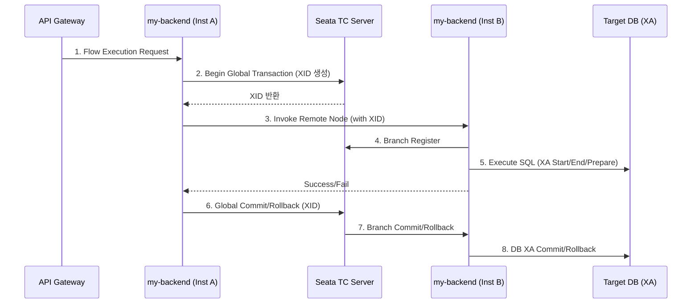

# my-backend Distributed Transaction Design (Seata XA Mode)

**Status**: [Draft/Design]
**Parent Module**: [my-backend](my-backend.md)
**Related Design**: [release-scope.md](../foundation/release-scope.md)

## 1. 개요
본 문서는 `my-backend` 컴포넌트가 여러 인스턴스에 분산되어 실행되는 환경에서, 데이터 일관성을 보장하기 위한 Seata 기반 분산 트랜잭션(Distributed Transaction) 아키텍처를 정의한다. 특히 기존 설계와의 호환성을 위해 **XA 모드**를 기본 채택한다.

## 2. 시스템 아키텍처 (Seata Components)

Seata의 3대 핵심 컴포넌트를 `my-backend` 생태계에 다음과 같이 매핑한다.

| 컴포넌트 | 명칭 | NexioOne 내 역할 |
| :--- | :--- | :--- |
| **TC** | Transaction Coordinator | 트랜잭션 상태 유지 및 2PC 코디네이션을 담당하는 독립 서버 (K8S StatefulSet) |
| **TM** | Transaction Manager | 글로벌 트랜잭션의 시작과 종료(Commit/Rollback)를 결정하는 `my-backend` 인스턴스 |
| **RM** | Resource Manager | 실제 DB 노드를 실행하고 브랜치 트랜잭션을 관리하는 `my-backend` 인스턴스 |

### 2.1 분산 실행 모델 다이어그램



## 3. 세부 구현 방안

### 3.1 Seata XA 모드 동작 원리
- **DataSource Proxy**: `my-backend`는 일반 `XADataSource`를 Seata가 제공하는 `DataSourceProxyXA`로 래핑하여 사용한다.
- **자동 전파**: 인스턴스 간 호출(`FLOW_TASK` 원격 호출 등) 시, HTTP 헤더나 메시지 페이로드에 `XID`(Global Transaction ID)를 실어 보낸다.
- **강력한 정합성**: 2PC(Two-Phase Commit)를 통해 여러 인스턴스와 여러 DB에 걸친 원자성(Atomicity)을 보장한다.

### 3.2 분산 컨텍스트 및 리소스 관리
- **XID 전파**: `FlowExecutionContext`에 XID를 포함하여, 분산된 노드들이 동일한 트랜잭션 범위 내에 있음을 인식하게 한다.
- **Connection Pool**: Seata 전용 프록시 풀을 사용하며, 트랜잭션 종료 시까지 커넥션을 점유하는 XA 특성을 고려하여 풀 사이즈를 최적화한다.

## 4. 인프라 구성 및 배포 전략

### 4.1 K8S 기반 구성
- **Deployment**: `StatefulSet`을 사용하여 고가용성 확보.
- **Discovery**: K8S Internal Service DNS를 통해 TC 서버 접근.
- **Storage**: TC 세션 정보 저장을 위해 외부 PostgreSQL 또는 Redis 연동.

### 4.2 Non-K8S (Bare Metal / VM) 기반 구성
K8S가 없는 환경에서는 다음과 같은 구성 방안을 따른다.

- **TC 서버 실행**: Seata Standalone 바이너리를 사용하여 독립 프로세스로 실행. 안정적인 운영을 위해 `systemd` 서비스로 등록 권장.
- **서비스 디스커버리 (Service Discovery)**:
    - **Registry 모드**: Nacos, Consul, Zookeeper, Eureka 등을 설치하여 TM/RM 인스턴스가 TC를 동적으로 찾도록 설정.
    - **File 모드**: 인스턴스 수가 적거나 고정적인 경우, `application.yml`의 `grouplist`에 TC 서버의 고정 IP와 포트를 직접 명시.
- **고가용성 (High Availability)**:
    - 여러 VM에 TC를 분산 배치하고, 상단에 **L4 로드밸런서**를 두어 VIP(Virtual IP)를 통해 접근하거나, 클라이언트 사이드 로드밸런싱(Registry 기반) 활용.
- **네트워크 설정**: TM/RM 인스턴스와 TC 간의 RPC 통신 포트(기본 8091)에 대한 방화벽 허용 필수.

### 4.3 설정 구성 (Non-K8S Static 예시)
```yaml
seata:
  enabled: true
  application-id: my-backend
  tx-service-group: nexio_tx_group
  service:
    vgroup-mapping:
      nexio_tx_group: default
    grouplist:
      default: "192.168.1.10:8091, 192.168.1.11:8091" # 고정 IP 나열
  registry:
    type: file # 또는 nacos, consul 등
```

## 5. 예외 처리 및 복구 (Reliability)

### 5.1 타임아웃 관리
- **Global Timeout**: 플로우 전체 실행 시간을 고려하여 글로벌 트랜잭션 타임아웃을 설정한다.
- **Automatic Rollback**: 타임아웃 발생 시 TC가 모든 RM에 롤백 명령을 하달한다.

### 5.2 인스턴스 장애 복구
- **Crash Recovery**: RM(my-backend 인스턴스)이 작업 도중 다운되더라도, 인스턴스 재시작 시 TC와의 통신을 통해 미결 트랜잭션(In-doubt Transaction)을 자동 복구한다.

## 6. 모니터링 및 운영 (Observability)

- **Seata Metrics**: Prometheus와 연동하여 글로벌 트랜잭션 성공률, 평균 소요 시간, 롤백 비율 등을 모니터링한다.
- **Transaction Viewer 연동**: `logging-service`에 저장되는 실행 로그에 `XID`를 기록하여, 트랜잭션 뷰어에서 여러 인스턴스의 작업을 하나의 트랜잭션으로 묶어 시각화한다.
