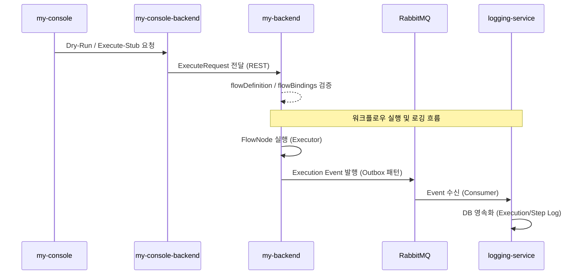

# my-backend Specification

**Status**: [Not Implemented] - 제품 범위에 포함되며, 본 문서는 목표 런타임 기능을 정의한다.

## 개요
NexioOne의 핵심 워크플로우 실행 엔진(Runtime)으로, `my-console-backend`로부터 전달된 워크플로우(Flow)와 연결 정보(Connection)를 바탕으로 실행을 담당할 Stateless 워커 인스턴스이다.

이번 프로그램 포함 범위는 `docs/spec/foundation/release-scope.md`를 우선 기준으로 해석한다. 본 문서의 차기 범위 항목은 MVP 포함 여부 판단 기준이 아니다.

## 기술 스택
- **Framework**: Spring Boot
- **Messaging**: RabbitMQ (Execution Event Outbox) - 이번 프로그램 포함
- **Coordination**: Redis (Snapshot, Pub/Sub, Lease Gate, Counter) - 차기 범위
- **Scheduler**: Quartz (RAMJobStore 기반 로컬 실행) - 차기 범위
- **Transaction**: JTA (XA/2PC 코디네이션) - 차기 범위

## 주요 기능

### 1. Flow Node Execution
- `flowDefinition` 기반의 컴포넌트 유형별 실행기(`FlowNodeExecutor`) 라우팅.
- **이번 프로그램 지원 수준**:
  - `DRY_RUN`: `START`, `END` 중심 구조/입력 검증
  - `EXECUTE_STUB`: `START`, `END`, `MAPPING`, `REST_CLIENT`, `SQL_EXECUTOR`의 stub 실행
- **차기 범위**:
  - `SQL_BATCH_EXECUTOR`, `FILE_INPUT`, `FILE_OUTPUT`, `FILE_VALIDATOR`, `FORMAT_CONVERTER`, `RECORD_EXTRACT`
- 동기(`POST /execute`) 및 비동기(`POST /execute/async`) 실행 모델을 목표로 한다.

### 2. Runtime Schedule Trigger
- 이번 프로그램에서는 상태 조회 API 골격만 포함한다.
- Redis 기반 분산 클러스터 스케줄링과 실제 자동 작업 실행은 차기 범위다.

### 3. Execution Architecture

### 4. Lifecycle & Logging Integration
- 실행 상태 전이 이벤트를 RabbitMQ로 전달하는 구조를 목표로 한다.
- 재시도 정책과 전달 보장 방식은 내부 계약 문서를 따른다.
- Redis Pub/Sub 기반 snapshot 배포와 분산 스케줄 동기화는 차기 범위다.

### 5. Runtime Instance Registry
- 실시간 인스턴스 등록 및 상태 모니터링 기능은 차기 범위다.

## 이번 프로그램 / 차기 프로그램 구분

### 이번 프로그램 포함
- `DRY_RUN`, `EXECUTE_STUB`, execution status 조회
- `START`, `END`, `MAPPING`, `REST_CLIENT`, `SQL_EXECUTOR` 범위의 stub 실행
- RabbitMQ 기반 execution event 발행

### 차기 프로그램
- real connector 실행
- Redis 기반 snapshot/config sync
- Quartz 기반 실제 분산 스케줄링
- XA/2PC 및 고급 node type 지원

## 연관 문서
- [Runtime Schedule Distribution Architecture](../runtime/runtime-schedule-distribution-architecture.md)
- [Runtime Execution Logging Architecture](../runtime/runtime-execution-logging-architecture.md)
- [Runtime Node Support Matrix](../runtime/runtime-node-support-matrix.md)
- [Release Scope Baseline](../foundation/release-scope.md)
