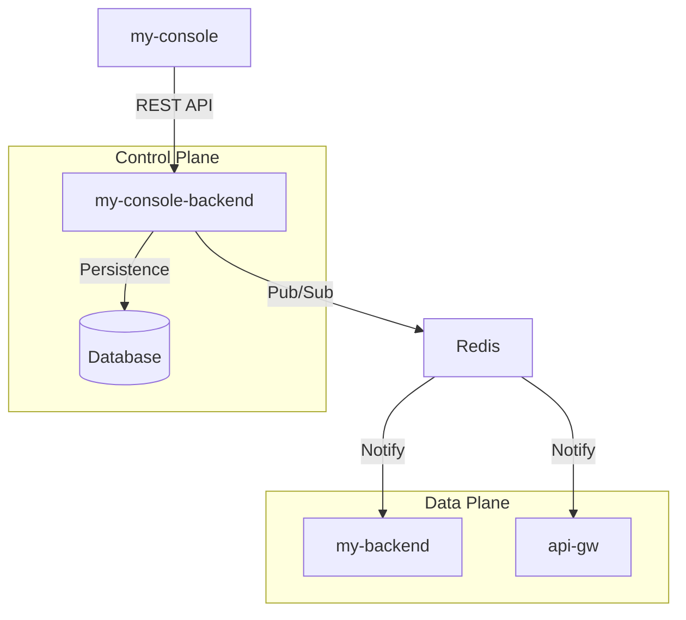

# my-console-backend Specification

**Status**: [Not Implemented] - 제품 범위에 포함되며, 본 문서는 목표 제어 평면 기능을 정의한다.

## 개요
NexioOne의 관리 및 제어용 백엔드 서비스로, 관리 API 제공, 워크플로우 설계 데이터 영속화, 설정 동기화 및 전반적인 시스템 오케스트레이션을 담당할 예정이다.

## 기술 스택
- **Framework**: Spring Boot
- **Persistence**: Spring Data JPA, H2 (In-Memory) 또는 PostgreSQL
- **Security**: Spring Security (JWT, OIDC)
- **Communication**: REST, gRPC (Control Plane), Redis Pub/Sub

## 주요 기능

### 1. API Governance
- API 엔드포인트 정의 및 메타데이터 관리.
- Rate Limit 및 Quota 정책 제어.
- OAS(OpenAPI Specification) 스펙 생성 및 관리.

### 2. Config Sync Architecture

### 3. Workflow Engine
- Flow Designer에서 생성된 JSON 워크플로우 데이터의 영속화 및 버전 관리.
- Flow Node/Edge 관계 및 조건 분기 설정의 정합성 검증.

### 4. Execution Control (Control Plane)
- **API Orchestrator**: REST 호출 기반 워크플로우 매핑 및 동기/비동기 실행 제어.
- **Distributed Scheduler Control**: 분산 클러스터 기반 Cron 작업 스케줄링 제어 및 상태 모니터링.
- **Event Trigger Control**: MQ 메시지 리스너 및 sFTP 파일 감지 트리거 제어.

### 5. Connection Manager
- 외부 리소스(JDBC, REST, MQ, sFTP 등) 연결 정보의 암호화 저장 및 상태 모니터링.

### 6. Security & RBAC
- JWT 기반 사용자 인증 및 역할(Role) 기반 접근 제어.
- 민감 정보(Secret)의 안전한 암호화 및 복호화 처리.

## 연관 문서
- [API Spec](../api/api-spec.md)
- [Control Plane API Baseline](../api/control-plane-api-baseline.md)
- [Runtime Operations Spec](../runtime/runtime-operations-spec.md)
- [Data Definition Import Design](../data/data-definition-import-from-db.md)
- [Flow Owned Data Definition Design](../data/flow-owned-data-definition-roles.md)
- [Runtime Schedule Distribution Architecture](../runtime/runtime-schedule-distribution-architecture.md)
- [Functional DoD Matrix](../foundation/functional-dod-matrix.md)
- [Traceability Spec](../foundation/traceability-spec.md)
