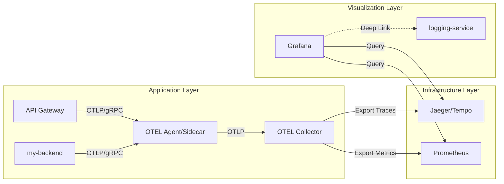

# Observability Infrastructure Design (OTEL, Jaeger & Grafana)

**Status**: [Draft/Design]
**Related Modules**: [logging-service](logging-service.md), [api-gw](api-gw.md), [my-backend](my-backend.md)

## 1. 개요
본 문서는 NexioOne의 분산 환경에서 발생하는 트레이스(Trace), 메트릭(Metric) 데이터를 통합적으로 수집, 저장, 시각화하기 위한 **OpenTelemetry(OTEL), Jaeger, Grafana** 인프라의 구성 방안을 정의한다.

## 2. 관측성 데이터 파이프라인 아키텍처



## 3. OTEL Agent 구성 및 역할

애플리케이션 및 인프라의 데이터를 최전선에서 수집하는 에이전트의 유형을 정의한다.

### 3.1 Application Agent (Java Auto-instrumentation)
Java 기반 서비스(`my-backend`, `my-console-backend`)의 코드를 수정하지 않고 런타임에 데이터를 수집한다.

- **컴포넌트**: `opentelemetry-javaagent.jar`
- **수집 대상**: HTTP(Spring MVC, RestTemplate, WebClient), JDBC(DB Query), RabbitMQ 메시징, Redis 명령 등.
- **설정 방안**:
  - JVM 옵션 주입: `-javaagent:/path/to/opentelemetry-javaagent.jar`
  - 환경 변수 설정:
    - `OTEL_SERVICE_NAME`: 서비스 식별자 (예: `my-backend`)
    - `OTEL_EXPORTER_OTLP_ENDPOINT`: Agent/Collector 주소 (예: `http://localhost:4317`)
    - `OTEL_RESOURCE_ATTRIBUTES`: `env=prod,version=1.0` 등 공통 속성.

### 3.2 Host/Infrastructure Agent (OTEL Collector Agent Mode)
VM 또는 Bare Metal 서버의 시스템 지표를 수집하고 애플리케이션 데이터를 중계한다.

- **컴포넌트**: `otelcol` 바이너리 (Agent Mode)
- **수집 대상**: CPU, Memory, Disk I/O, Network 등 호스트 메트릭.
- **역할**:
  - **Local Aggregation**: 해당 서버 내의 여러 앱에서 보낸 데이터를 취합 후 중앙 Collector로 전송.
  - **Security**: 중앙 수집기의 엔드포인트를 노출하지 않고 에이전트를 통해서만 데이터 수집 가능하도록 격리.

## 4. 구성 요소별 상세 설계 (Collector & Backend)

### 4.1 OTEL Collector (Central Hub)
모든 에이전트로부터 데이터를 수집하여 가공 후 백엔드로 전송한다.
... (기존 내용 유지)

### 4.2 Jaeger / Grafana Tempo (Trace Storage)
... (기존 내용 유지)

### 4.3 Grafana (Unified Visualization)
... (기존 내용 유지)

## 5. 인프라 배포 전략

### 5.1 K8S 환경 (Cloud Native)
- **OTEL Operator**: `OpenTelemetryCollector` 및 `Instrumentation` CRD를 사용하여 사이드카 주입 및 Java Agent 자동 설정을 관리한다.

### 5.2 Non-K8S 환경 (Bare Metal / VM)
- **Java Agent**: 서비스 배포 스크립트에 jar 파일 포함 및 JVM 옵션 자동화.
- **Host Agent**: 각 VM당 하나씩 `otelcol`을 `systemd`로 실행하여 중앙 수집기로 전달하는 계층 구조 구축.
...


- **Correlation (상관관계)**:
  - **Metrics to Traces**: 특정 시점의 에러 급증(Metric) 클릭 시 해당 시점의 트레이스(Trace) 목록으로 점프.
  - **Traces to Logs**: 트레이스 상세 뷰에서 `execution_id` 태그를 클릭하면 `logging-service`의 비즈니스 로그 뷰어로 연결되는 Deep Link 구성.

## 4. logging-service 연동 규격

`logging-service`가 생성하는 외부 시각화 링크의 템플릿 규정을 정의한다.

### 4.1 링크 템플릿 구성
- **Trace Link**: `https://{grafana-host}/explore?orgId=1&left=["now-1h","now","tempo",{"query":"${trace_id}"}]`
- **Span Link**: 트레이스 링크에 특정 `spanId` 필터를 추가하여 해당 노드의 실행 지점으로 바로 이동.

### 4.2 설정 파라미터 (logging-service)
```yaml
nexio:
  observability:
    visualization:
      type: GRAFANA_TEMPO # 또는 JAEGER
      base-url: "https://grafana.nexioone.com"
      org-id: 1
```

## 5. 인프라 배포 전략

### 5.1 K8S 환경 (Cloud Native)
- **OTEL Operator**: `OpenTelemetryCollector` CRD를 사용하여 사이드카(Sidecar) 또는 Deployment 모드로 배포.
- **Helm**: Jaeger와 Grafana를 공인 Helm 차트를 통해 설치.

### 5.2 Non-K8S 환경 (Bare Metal / VM)
- **Docker Compose**: 전체 스택을 하나의 Compose 파일로 묶어 오케스트레이션.
- **Standalone Binary**: 각 컴포넌트를 독립 프로세스로 실행하고, `systemd`로 관리.
- **Agent/Collector 구조**: 각 서버에 경량 `OTEL Agent`를 설치하여 데이터를 수집하고 중앙 `OTEL Collector`로 전달하여 네트워크 부하 분산.

## 6. 기대 효과
- **MTTR(평균 복구 시간) 단축**: 비즈니스 에러 로그와 시스템 지연 현상을 단일 Trace ID로 추적 가능.
- **인프라 독립성**: OTEL 표준 프로토콜을 사용하므로, 추후 Jaeger에서 Tempo나 Datadog 등 다른 솔루션으로 교체 시 애플리케이션 코드 수정이 불필요함.
