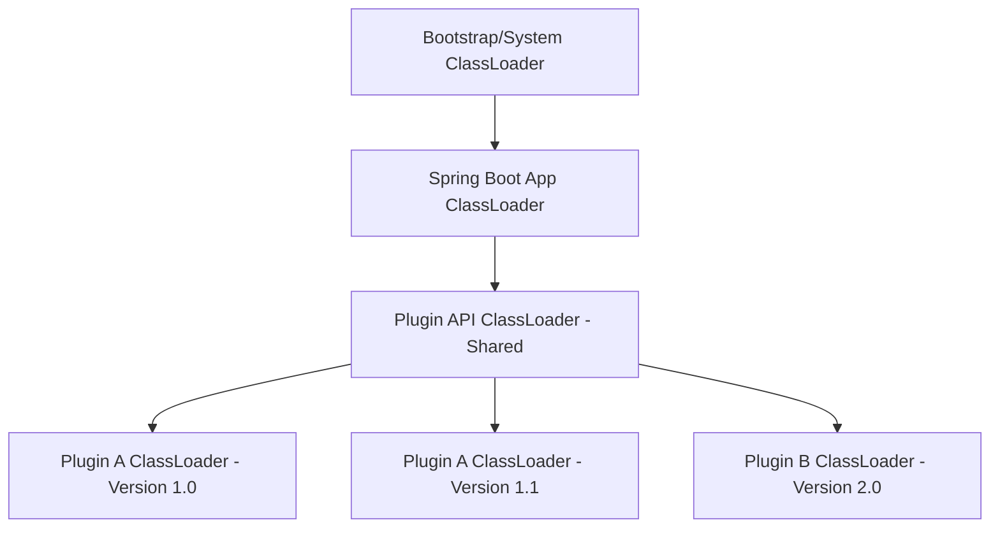

# plugins Detailed Design (Custom ClassLoader & Lifecycle)

**Status**: [Draft/Detailed Design]
**Parent Module**: [plugins](plugins.md)
**Related ADR**: `ADR-001: Runtime Component Artifact Separation` (문서 미존재)

## 1. 개요
본 문서는 NexioOne `my-backend`에서 워크플로우 컴포넌트(FlowNode)를 동적으로 로드하고 격리하여 실행하기 위한 자바 커스텀 클래스로더 기반의 플러그인 메커니즘 상세 설계를 정의한다.

## 2. 클래스로더 계층 구조 (Classloader Hierarchy)
의존성 충돌을 방지하고 컴포넌트 간 격리를 위해 각 플러그인(또는 버전별)은 독립적인 `PluginClassLoader`에서 로드된다.



- **App ClassLoader**: `my-backend` 본체 및 공통 라이브러리.
- **Plugin API ClassLoader**: `my-backend-component-api`를 포함하며, 모든 플러그인이 공유해야 하는 인터페이스 정의.
- **Plugin ClassLoader**: 개별 플러그인 JAR 및 해당 플러그인 전용 의존성 라이브러리 로드. `Parent-Last` 전략을 선택적으로 적용하여 본체와 다른 버전의 라이브러리 사용 가능.

## 3. 플러그인 로딩 프로세스 (Loading Sequence)

1.  **Artifact Fetch**: `my-console-backend`로부터 배포 신호를 받거나 기동 시, Object Storage(MinIO)에서 `component.jar`와 `manifest.json`을 로컬 캐시 디렉토리로 다운로드.
2.  **Verification**: `manifest.json`의 SHA-256 체크섬을 대조하고, 선택적으로 디지털 서명을 검증.
3.  **ClassLoader Creation**: 해당 컴포넌트 전용 `PluginClassLoader` 인스턴스 생성.
4.  **SPI / Entrypoint Scanning**: `manifest.json`에 정의된 `entrypointClass`를 로드하거나 `ServiceLoader` 메커니즘을 통해 `FlowNodeProvider`를 탐색.
5.  **Registration**: 로드된 `FlowNodeExecutor`를 `my-backend`의 `PluginRegistry`에 등록. 기존 활성 버전이 있을 경우 점진적 교체(Hot-swap).

## 4. PluginClassLoader 상세 설계 (Java)

### 4.1 핵심 요구사항
- **Parent-First/Last 제어**: `my-backend-component-api`는 Parent(Shared)에서 찾고, 그 외 라이브러리는 플러그인 JAR 내부에서 우선 검색.
- **Resource Isolation**: 플러그인 내부의 설정 파일(`properties`, `xml`)이 다른 플러그인에 노출되지 않도록 격리.

### 4.2 구조 초안
```java
public class PluginClassLoader extends URLClassLoader {
    private final Set<String> sharedPackages; // API 등 공유 패키지 목록

    public PluginClassLoader(URL[] urls, ClassLoader parent, Set<String> sharedPackages) {
        super(urls, parent);
        this.sharedPackages = sharedPackages;
    }

    @Override
    protected Class<?> loadClass(String name, boolean resolve) throws ClassNotFoundException {
        // 1. 이미 로드된 클래스 확인
        Class<?> c = findLoadedClass(name);
        if (c != null) return c;

        // 2. 공유 패키지(API 등)인 경우 Parent(Shared)에게 위임 (Parent-First)
        if (isSharedPackage(name)) {
            return super.loadClass(name, resolve);
        }

        // 3. 플러그인 내부 JAR에서 검색 (Parent-Last / Child-First 전략)
        try {
            c = findClass(name);
        } catch (ClassNotFoundException e) {
            // 플러그인 내부에 없으면 최종적으로 Parent에게 확인
            c = super.loadClass(name, resolve);
        }

        if (resolve) resolveClass(c);
        return c;
    }
}
```

## 5. Plugin Registry & Lifecycle

### 5.1 PluginRegistry 인터페이스
```java
public interface PluginRegistry {
    void register(PluginMetadata metadata, FlowNodeExecutor executor);
    Optional<FlowNodeExecutor> getExecutor(String componentType, String version);
    List<PluginMetadata> getActivePlugins();
    void unregister(String componentType, String version);
}
```

### 5.2 수명 주기 (Lifecycle)
- **PREPARING**: 아티팩트 다운로드 및 검증 중.
- **ACTIVATING**: 클래스로더 생성 및 인스턴스 초기화 중.
- **ACTIVE**: 실제 워크플로우 실행에 투입 가능.
- **DEACTIVATING**: 새로운 버전으로 교체되거나 제거되기 전 대기 상태.
- **REMOVED**: 메모리에서 해제 및 클래스로더 폐기.

## 6. 보안 및 예외 처리
- **Security Manager (선택적)**: 플러그인 코드가 시스템 파일이나 네트워크에 직접 접근하는 것을 제한하기 위해 Java Security Manager 또는 별도 샌드박스 정책 적용 검토.
- **Resource Leak 방지**: 플러그인 언로드(`unregister`) 시 클래스로더를 명시적으로 Close하고, 정적 변수 등으로 인한 메모리 누수가 발생하지 않도록 가이드라인 제공.
- **Version Compatibility**: `manifest.json`의 `minRuntimeVersion` 필드를 통해 `my-backend` 본체와의 호환성 사전에 체크.

## 7. 구현 로드맵
1.  **Phase 1**: 로컬 파일 시스템 기반의 단순 `URLClassLoader` 로더 구현.
2.  **Phase 2**: `Parent-Last` 클래스 로딩 전략 및 `my-backend-component-api` 공유 레이어 분리.
3.  **Phase 3**: Object Storage 연동 및 체크섬 검증 로직 추가.
4.  **Phase 4**: 플러그인 Hot-swap 및 구버전 클래스로더 안전 제거(GC) 메커니즘 고도화.
