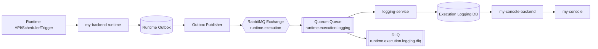

# Runtime Execution Logging Architecture

## 1. 배경
- runtime(`my-backend`)은 향후 전용 API 모듈, 스케줄러, 트리거를 통해 플로우 실행을 수신한다.
- `my-console-backend`는 runtime의 실행 요청/응답 경로에 직접 참여하지 않고, 저장된 실행 결과를 조회/가공해 `my-console`에 제공하는 read API 역할을 수행한다.
- 따라서 runtime 실행 결과를 `my-console-backend`로 직접 되돌리는 구조는 목표 아키텍처와 맞지 않는다.
- 별도 `logging-service`가 runtime 실행 결과를 수집/저장하고, `my-console-backend`는 해당 저장소를 조회하는 구조가 필요하다.

## 2. 목표
- runtime 실행 결과를 비동기 방식으로 수집해 사용자 요청 경로와 분리한다.
- 실행 완료 이벤트를 유실 최소화, 중복 허용(at-least-once), 재처리 가능 구조로 저장한다.
- `my-console-backend`는 read 전용 계층으로 단순화한다.
- 추후 감사 로그, 운영 통계, 알림, 재처리 분석에 재사용 가능한 공용 이벤트 파이프라인을 마련한다.

## 3. 비목표
- 본 문서는 분산 트레이싱(OpenTelemetry) 전체 설계를 다루지 않는다.
- 본 문서는 실시간 stream analytics 플랫폼 구축을 목표로 하지 않는다.
- 본 문서는 `logging-service`의 전체 UI/API 구현 상세를 규정하지 않는다.
- 본 문서는 runtime 이벤트 schema를 별도로 정의하지 않으며, 단일 계약은 `runtime-event-schema.md`를 따른다.

## 4. 권장 아키텍처

핵심 원칙:
- runtime은 실행 결과를 동기 응답으로 caller에 반환할 수 있지만, 영속 저장 책임은 `logging-service`에 위임한다.
- runtime과 logging 사이의 통신은 메시지 큐 기반 비동기 전달로 분리한다.
- 전달 보장은 `at-least-once`를 기준으로 설계하고, 소비자 측 멱등성으로 중복을 흡수한다.
- stage 1에서 비동기 실행의 진행 상태 정본은 `my-backend`이며, `logging-service`는 완료/이력 read model을 담당한다.
- stage 1에서 `my-console-backend`의 logging read path는 `logging-service` DB/전용 schema direct read로 시작한다.

## 5. 큐 선택 제안
권장안: `RabbitMQ + quorum queue`

선정 이유:
- 현재 요구사항은 대규모 event streaming보다 "실행 결과를 안정적으로 적재하는 비동기 work queue"에 가깝다.
- producer confirm, consumer manual ack, DLQ, retry 구성이 단순하고 Spring Boot 통합이 용이하다.
- quorum queue를 사용하면 단일 classic queue보다 복제/가용성 측면에서 운영 안전성이 높다.
- logging-service는 보통 단일 소비자 그룹 패턴이므로 Kafka의 파티션/리텐션 운영 복잡도를 지금 당장 감수할 이유가 약하다.

후보 비교:

| 후보 | 장점 | 단점 | 권장도 |
|---|---|---|---|
| RabbitMQ quorum queue | ack/DLQ/retry/publisher confirm 구성이 단순, work queue 적합, 운영 진입장벽 낮음 | 초대형 장기 보관/다중 분석 소비자에는 Kafka보다 확장성이 제한적 | 권장 |
| Kafka | 장기 보관, 다중 consumer, 대규모 스트림 분석에 유리 | 운영 복잡도 높고 현재 요구에 비해 무거움 | 차후 확장 시 검토 |
| NATS JetStream | 경량, 빠른 성능, 단순한 배포 가능 | 팀 표준/운영 경험이 없으면 도입 리스크 | 보류 |

채택 기준:
- 1차 프로그램 범위는 `RabbitMQ quorum queue`
- 차후 외부 분석 파이프라인, 장기 이벤트 재생, 다중 다운스트림 확대가 필요하면 Kafka 도입을 재검토한다.

## 6. 메시지 전달 보장 규칙
- 보장 수준: `at-least-once`
- producer:
  - RabbitMQ publisher confirm 사용
  - 메시지 persistent delivery 사용
- consumer:
  - manual ack 사용
  - DB commit 성공 후 ack
  - 비복구 오류는 reject 후 DLQ 이동
- 저장:
  - `eventId` 또는 `executionId + sequence` 기준 unique constraint를 둬 멱등 처리

## 7. Runtime Outbox 패턴
runtime이 실행 완료 직후 바로 MQ publish만 수행하면 다음 위험이 남는다.
- 실행은 성공했지만 MQ publish 전에 프로세스 종료
- 브로커 일시 장애로 결과 이벤트 누락

따라서 runtime 내부에 outbox를 둔다.

권장 흐름:
1. flow 실행 종료
2. runtime 로컬 DB/스토리지에 execution outbox 레코드 저장
3. 별도 publisher worker가 outbox 미전송 레코드를 RabbitMQ로 publish
4. confirm 수신 후 outbox 상태를 `PUBLISHED`로 전환

outbox 저장소 초기안:
- 테이블명: `TB_RUNTIME_EXECUTION_OUTBOX`
- 주요 컬럼:
  - `id`
  - `event_id`
  - `execution_id`
  - `event_type`
  - `payload_json`
  - `publish_status` (`PENDING`, `PUBLISHED`, `FAILED`)
  - `publish_attempts`
  - `next_attempt_at`
  - `last_error`
  - `created_at`
  - `published_at`

## 8. 이벤트 모델
- 단일 이벤트 schema는 `runtime-event-schema.md`를 기준으로 사용한다.
- 이번 프로그램의 기본 이벤트 타입:
  - `execution.started`
  - `execution.step.completed`
  - `execution.completed`
  - `execution.failed`
- 차기 범위:
  - replay/reprocess 이벤트
  - result archive/object storage reference
  - trace context 확장

## 9. RabbitMQ 토폴로지
- exchange: `runtime.execution`
- exchange type: `topic`
- main routing key pattern: `execution.#`
- queue: `runtime.execution.logging`
- DLQ exchange: `runtime.execution.dlx`
- DLQ queue: `runtime.execution.logging.dlq`
- queue type: `quorum`

권장 정책:
- main queue:
  - durable
  - quorum
  - dead-letter-exchange=`runtime.execution.dlx`
- DLQ:
  - durable
  - 필요 시 운영자 수동 재주입 또는 별도 replayer 사용

DLQ 이동 기준:
- schema invalid
- 역직렬화 불가
- 필수 필드 누락
- persistence 재시도 한도 초과
- 위 외의 일시적 오류는 재시도 후 처리

## 10. logging-service 책임
- MQ consumer로 execution 이벤트 수신
- envelope/schema validation
- 멱등성 검증 후 DB upsert
- 조회 최적화된 read model 저장
- 필요 시 `resultReference`를 사용해 object storage 원문 조회 API를 별도 제공
- 실패 이벤트를 DLQ 또는 장애 알람으로 노출

저장 모델 초기안:
- `execution_event`
  - 원본 이벤트 envelope 저장
- `execution_record`
  - `executionId`, `flowKey`, `projectId`, `status`, `startedAt`, `finishedAt`, `durationMs`, `triggerType`, `requestedBy`
- `execution_step`
  - `executionId`, `stepOrder`, `stepId`, `status`, `durationMs`, `message`

Projection 규칙:
- `execution_event`는 원본 envelope 보존용이다.
- `execution_record`, `execution_step`은 조회 최적화 projection이며 payload 전체 복제를 금지한다.
- `connectionProfiles`, `flowBindings`, secret 원문, `secretsRef`, binding schema 전체는 projection에 저장하지 않는다.

분리 이유:
- 원본 이벤트 보존과 조회 최적화 read model을 분리하면 schema evolution 대응이 쉽다.

## 11. 참조
- `docs/spec/runtime/runtime-event-schema.md`

## 11. my-console-backend 책임 재정의
- runtime에 실행 결과를 요청/수신하지 않는다.
- 진행 중 execution 제어 상태는 runtime API를 프록시/중계할 수 있다.
- 실행 이력/검색/집계는 `logging-service` DB 또는 logging read API를 조회한다.
- object storage 원문은 직접 소유하지 않고, 필요 시 `logging-service` 또는 전용 archive API를 통해 참조한다.
- `my-console`에는 다음 read API를 제공한다.
  - in-flight execution 상태 중계 또는 통합 조회
  - execution 목록
  - execution 상세
  - flow별 최근 실행
  - 상태/기간별 summary

권장 방향:
- 1차는 `my-console-backend -> logging DB read replica/전용 schema` 직접 조회로 고정
- 2차는 서비스 경계 강화를 위해 `my-console-backend -> logging-service read API`로 전환 검토

## 12. 실패/재처리 정책
- 브로커 publish 실패:
  - outbox에 남기고 exponential backoff 재시도
- consumer DB 저장 실패:
  - nack/requeue 제한 횟수 적용
  - 임계 초과 시 DLQ 이동
- duplicate event:
  - idempotent upsert 후 ack
- poison message:
  - schema invalid, 필수 필드 누락, 역직렬화 불가 시 DLQ 이동

권장 retry 기준:
- consumer persistence 오류: 최대 3회 재시도 후 DLQ
- schema invalid / 역직렬화 불가 / 필수 필드 누락: 재시도 없이 즉시 DLQ

운영 메트릭:
- runtime:
  - outbox pending count
  - outbox publish success/failure count
  - publish latency
- logging-service:
  - consumer lag(queue depth)
  - DB write success/failure count
  - DLQ count
  - duplicate discard count

## 13. 보안/컴플라이언스
- payload/result에서 secret 필드는 publish 전에 제거 또는 마스킹
- event payload 최대 크기 제한을 둔다.
- execution result 보존 기간(retention)과 archive 정책을 별도 설정으로 분리한다.
- queue와 DB 접근 권한은 runtime publisher, logging consumer, read service로 최소 권한 분리한다.

## 14. 단계별 구현 제안
### Phase 1
- RabbitMQ 도입
- runtime outbox 테이블 + publisher worker
- `logging-service` 신규 모듈 부트스트랩
- `execution.started`, `execution.step.completed`, `execution.completed`, `execution.failed` lifecycle 이벤트 저장

### Phase 2
- execution summary/materialized view
- DLQ re-drive 도구
- my-console-backend 조회 API 전환

### Phase 3
- replay/reprocess 계열 이벤트 확장
- tracing correlation
- 장기 보관/archive 파이프라인

## 15. 오픈 이슈
- logging 저장소를 독립 DB로 둘지, 기존 운영 DB 내 별도 schema로 둘지 결정 필요
- result 원문 저장 상한과 압축 정책 결정 필요
- replay/DLQ 재주입 권한 모델 정리가 필요

## 16. 구현 원칙 요약
- runtime과 logging 간 통신은 비동기 큐 기반으로 분리한다.
- 1차 큐는 `RabbitMQ quorum queue`를 채택한다.
- 전달 보장은 `at-least-once`, 중복 제어는 소비자 멱등성으로 해결한다.
- 유실 방지를 위해 runtime은 outbox 패턴을 사용한다.
- `my-console-backend`는 execution logging의 read 계층으로 한정한다.
