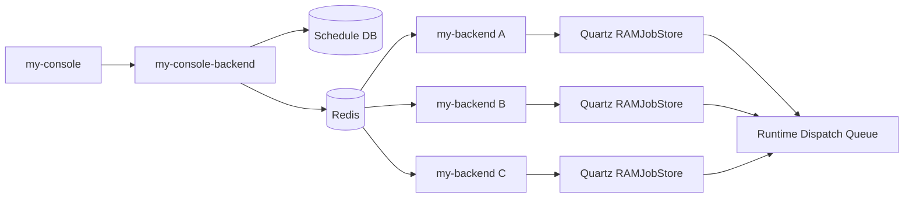

# Runtime Schedule Distribution Architecture

## 1. 목적
- `my-console-backend`가 관리하는 `Schedule`을 `my-backend` 인스턴스 집합에 배포하고 실행하는 방식을 정의한다.
- Quartz 기본 JDBC cluster의 job acquisition에 실행 ownership를 맡기지 않고, 배포 시점에 인스턴스 topology를 제어한다.
- 스케줄별 분산 정책으로 `ACTIVE_STANDBY`, `ROUND_ROBIN`을 지원한다.

## 2. 배경
- Quartz JDBC cluster는 fail-over는 제공하지만, 특정 스케줄의 active 인스턴스를 운영자가 지정/고정하는 모델은 아니다.
- `RAMJobStore`는 인스턴스 간 공유 JobStore가 없으므로 Quartz cluster 자체로는 분산 실행을 구현할 수 없다.
- 따라서 구조는 `로컬 Quartz + Redis coordination`으로 분리한다.

## 3. 설계 원칙
- 각 `my-backend` 인스턴스는 자신에게 배포된 schedule만 로컬 Quartz `RAMJobStore`에 등록한다.
- schedule 정의/assignment의 source of truth는 상위 관리 계층(`my-console-backend`)이다.
- Redis는 다음 용도로만 사용한다.
  - instance registry / heartbeat
  - schedule deployment event fan-out
  - active lease 관리
  - round-robin cursor 및 assignment coordination
- 실제 flow 실행은 기존 runtime dispatch queue 경로를 재사용한다.

## 4. 상위 구조

## 5. 배포 모델

### 5.1 Schedule 정의
- `scheduleId`
- `projectId`
- `flowId`
- `cronExpression`
- `timezone`
- `enabled`
- `distributionMode`
  - `ACTIVE_STANDBY`
  - `ROUND_ROBIN`
- `assignmentPolicy`
  - `preferredActiveInstanceId`
  - `candidateInstanceIds`
  - `instanceGroup`
  - `failbackPolicy`

### 5.2 배포 시점 결정
- schedule 저장/배포 요청 시 `my-console-backend`가 현재 살아 있는 runtime instance를 조회한다.
- 정책에 따라 candidate instance set을 계산한다.
- Redis에 assignment snapshot을 기록한다.
- 각 선택된 instance로 schedule register 이벤트를 publish한다.

## 6. Redis Key Schema

### 6.1 Instance Registry
- `runtime:instances`
  - active instance id set
- `runtime:instance:{instanceId}:meta`
  - host, port, version, startedAt, lastHeartbeatAt, instanceGroup
- `runtime:instance:{instanceId}:heartbeat`
  - TTL key, instance 생존 판단 기준

### 6.2 Schedule Assignment
- `runtime:schedule:{scheduleId}:definition`
  - cron/timezone/flowId/enabled/distributionMode
- `runtime:schedule:{scheduleId}:assignment`
  - candidateInstanceIds, preferredActiveInstanceId, failbackPolicy
- `runtime:schedule:{scheduleId}:deploy:version`
  - 배포 버전

### 6.3 Active-Standby
- `runtime:schedule:{scheduleId}:active-lease`
  - value: `instanceId`
  - TTL 기반 lease

### 6.4 Round-Robin
- `runtime:schedule:{scheduleId}:rr-counter`
  - atomic increment counter
- `runtime:schedule:{scheduleId}:rr-members`
  - round-robin candidate list snapshot

### 6.5 Event Channels
- `runtime:schedule:deploy`
  - register/update/delete 이벤트
- `runtime:schedule:deploy:{instanceId}`
  - instance targeted deployment channel

## 7. 배포 프로토콜

### 7.1 Register / Update
1. `my-console-backend`가 schedule 정의를 DB에 저장한다.
2. active runtime instance 목록을 조회한다.
3. `distributionMode`에 맞춰 candidate instance set을 계산한다.
4. Redis에 `definition`, `assignment`, `deploy:version`을 갱신한다.
5. 선택된 각 instance에 `REGISTER_OR_UPDATE` 이벤트를 publish한다.
6. 각 `my-backend`는 이벤트 수신 후 자기 로컬 Quartz에 job/trigger를 upsert한다.

### 7.2 Delete / Disable
1. DB 상태를 `deleted` 또는 `enabled=false`로 전환한다.
2. Redis snapshot을 갱신한다.
3. 각 대상 instance에 `DELETE` 이벤트를 publish한다.
4. 각 instance는 로컬 Quartz에서 job/trigger를 제거한다.

## 8. 실행 정책

### 8.1 ACTIVE_STANDBY
- candidate instance set 중 하나가 active lease holder가 된다.
- fire 시점에 lease owner만 실제 dispatch를 수행한다.
- lease owner가 아니면 trigger는 consume만 하고 실행은 skip한다.

#### 8.1.1 Lease 획득
- `SET key value NX PX leaseTtlMs`
- 성공한 인스턴스가 active
- active는 주기적으로 lease renew

#### 8.1.2 Failover
- active heartbeat 또는 lease가 만료되면 standby가 lease 재획득 시도
- 가장 먼저 lease를 획득한 standby가 새 active

#### 8.1.3 Failback
- `failbackPolicy`
  - `STICKY`: takeover한 standby가 계속 active 유지
  - `PREFERRED`: `preferredActiveInstanceId`가 복구되면 다음 renew window에서 active 회수
- 기본값은 `STICKY`

### 8.2 ROUND_ROBIN
- schedule fire 시 candidate list 기준으로 실행 담당자를 순환 선택한다.
- 선택 알고리즘:
  - Redis `INCR rr-counter`
  - `counter % activeMemberCount`
  - 해당 index의 instance만 실제 dispatch

#### 8.2.1 Membership 보정
- candidate 중 heartbeat TTL이 만료된 instance는 active member list에서 제외한다.
- active member가 0이면 dispatch 실패로 기록하고 alert 대상에 포함한다.

#### 8.2.2 Dispatch 보장
- 모든 candidate instance가 같은 schedule을 로컬 등록할 수 있다.
- 그러나 execution gate를 통과한 instance만 dispatch한다.
- 동일 fire time 중복 실행 방지를 위해 `scheduleId + scheduledFireTime` 기준 dedup key를 둘 수 있다.

## 9. my-backend 책임
- Redis 구독을 통해 schedule deploy event 수신
- 로컬 Quartz `RAMJobStore`에 job/trigger 등록
- trigger fire 시 distribution policy gate 실행
- gate 통과 시 기존 `ExecutionService` enqueue 경로로 flow 실행 요청
- heartbeat/instance metadata를 Redis에 주기적으로 갱신

## 10. my-console-backend 책임
- schedule CRUD 및 배포 오케스트레이션
- runtime instance registry 조회 API 제공 또는 Redis 직접 조회
- assignment 계산 및 deploy event publish
- 배포 버전 관리 및 drift 감지

## 11. 운영 규칙
- schedule 배포는 idempotent 해야 한다.
- 배포 이벤트에는 `scheduleId`, `deployVersion`, `operation`, `issuedAt` 포함
- instance는 자신이 보유한 로컬 deploy version보다 오래된 이벤트를 무시
- Redis 장애 시:
  - 새 배포는 실패 처리
  - 기존 로컬 Quartz 등록 스케줄은 정책에 따라 일시 정지 또는 continue 모드 선택 필요
- 운영 기본 권장:
  - `ACTIVE_STANDBY`는 `STICKY`
  - `ROUND_ROBIN`은 2개 이상 instance required

## 12. 트레이드오프
- 장점
  - schedule별로 active 인스턴스와 candidate set을 제어할 수 있다
  - Quartz JDBC cluster의 비결정적 ownership 문제를 피할 수 있다
  - `ACTIVE_STANDBY`와 `ROUND_ROBIN`을 동일 모델로 수용 가능하다
- 단점
  - Quartz cluster가 아니라 coordination 계층을 직접 구현해야 한다
  - Redis 의존성과 lease/heartbeat 운영 부담이 추가된다
  - misfire/recovery semantics를 Quartz 단독보다 더 엄격히 설계해야 한다

## 13. 차기 구현 순서
1. `ExecutionSchedule`에 `distributionMode`, `candidateInstanceIds`, `preferredActiveInstanceId`, `failbackPolicy` 추가
2. runtime instance registry/heartbeat 설계 확정 및 `my-backend` Redis registry + heartbeat 구현
3. `my-backend` Redis subscriber + local registrar skeleton 구현
4. `ACTIVE_STANDBY` lease gate service 구현
5. `ROUND_ROBIN` gate + dedup key service 구현
6. 로컬 Quartz `RAMJobStore`에 registered schedule을 upsert/remove하고 cron/timezone fire를 runtime dispatch로 연결
7. 배포/삭제/드리프트 감지 운영 API 추가
8. drift repair / local re-register 운영 액션 추가
9. my-console 운영 화면 또는 orchestration endpoint 연계
