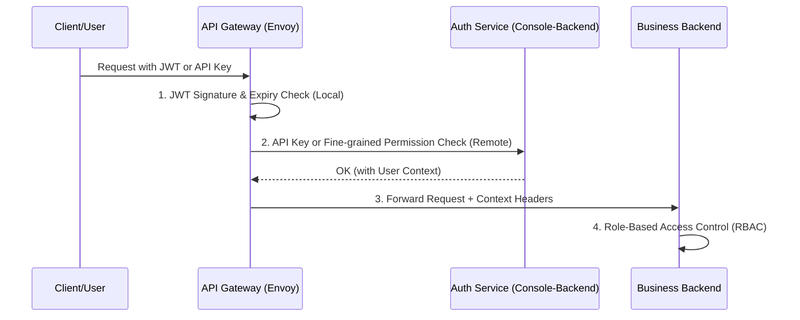

# Security & Identity Detailed Design

**Status**: [Draft/Design]
**Related Modules**: [api-gw](../modules/api-gw.md), [my-console-backend](../modules/my-console-backend.md)

## 1. 개요
본 문서는 NexioOne 시스템 전반의 보안 체계를 정의한다. 사용자 및 시스템 간의 인증(Authentication), 권한 부여(Authorization), 데이터 암호화, 그리고 민감 정보 관리 전략을 포함한다.

## 2. 인증 및 인가 아키텍처 (Identity Hierarchy)

NexioOne은 중앙 집중식 신원 관리와 분산된 권한 검증 모델을 따른다.

### 2.1 인증 유형 (Authentication Types)
1.  **User Authentication (Console)**: 관리자가 `my-console`에 접속할 때 사용 (OIDC/OAuth2 또는 ID/PW + MFA).
2.  **API Key Authentication (External)**: 외부 시스템이 NexioOne API Gateway를 통해 서비스를 호출할 때 사용.
3.  **Service-to-Service Authentication (Internal)**: 모듈 간 통신 시 상호 신뢰 보장.

### 2.2 인증 흐름 (End-to-End Flow)

## 3. 토큰 정책 및 관리 (Token Strategy)

### 3.1 JWT (JSON Web Token) 구조
- **Header**: RS256 알고리즘 및 키 ID(kid) 포함.
- **Payload**:
    - `sub`: 사용자 ID 또는 API Key ID.
    - `iss`: NexioOne Auth Issuer.
    - `exp`: 만료 시각 (Access Token: 1시간, Refresh Token: 7일).
    - `proj`: 접근 가능한 프로젝트 리스트.
    - `roles`: 사용자 역할 (Admin, Developer, Viewer 등).
- **Signature**: `my-console-backend`의 Private Key로 서명.

### 3.2 토큰 갱신 및 무효화 (Rotation & Invalidation)
- **Refresh Token Rotation**: Refresh Token 사용 시마다 새로운 토큰을 발급하여 보안을 강화한다.
- **Blacklist**: 탈취된 토큰은 Redis 기반 블랙리스트에 등록하여 즉시 무효화한다 (GW 필터에서 체크).

## 4. 서비스 간 보안 (Service-to-Service Security)

### 4.1 상호 TLS (mTLS)
- 모든 마이크로서비스 간 통신은 Envoy Sidecar 또는 SDK를 통해 mTLS를 강제한다.
- 인증서는 SDS (Secret Discovery Service)를 통해 주기적으로 자동 갱신된다.

### 4.2 내부 호출 전용 헤더 (Internal Context)
- `api-gw`는 인증 성공 후 다음과 같은 내부 헤더를 주입하여 백엔드로 전달한다.
    - `X-Nexio-User-Id`: 인증된 사용자 ID
    - `X-Nexio-Project-Id`: 현재 요청의 프로젝트 컨텍스트
    - `X-Nexio-Roles`: 사용자 권한 리스트

## 5. 민감 정보 관리 (Secret Management)

### 5.1 저장소 및 관리 도구
- **Vault/K8S Secrets**: DB 패스워드, 외부 API Secret, 암호화 키 등은 코드나 환경 변수에 직접 노출하지 않는다.
- **Dynamic Secrets**: 가능한 경우 DB 접근 권한 등을 동적으로 생성하여 사용하고 폐기한다.

### 5.2 암호화 규격
- **At-Rest**: DB 내 민감 필드(API Key 원문 등)는 AES-256-GCM으로 암호화하여 저장한다.
- **In-Transit**: 모든 통신은 TLS 1.2 이상을 의무적으로 사용한다.

## 6. 감사 및 모니터링 (Security Audit)
- **Audit Logs**: 모든 관리자 작업(생성, 수정, 삭제, 권한 변경)은 `TB_AUDIT_LOG`에 영구 기록한다.
- **Security Metrics**: 인증 실패 횟수, 비정상적인 대량 요청 등을 OTEL 메트릭으로 수집하여 탐지한다.
